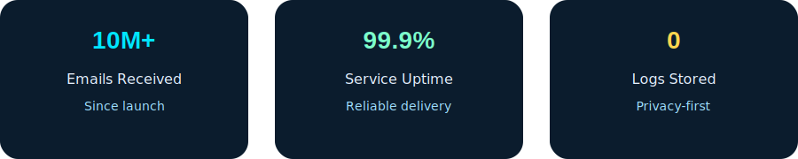
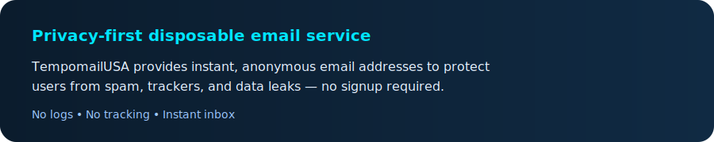
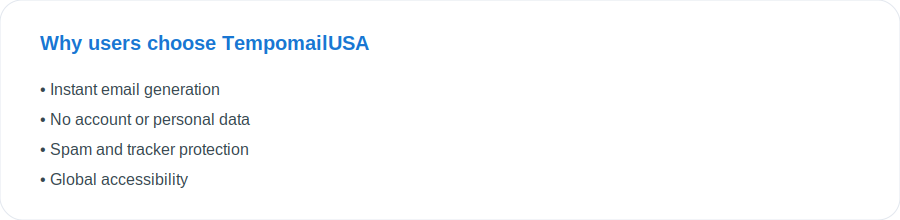
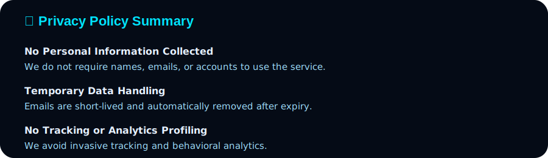
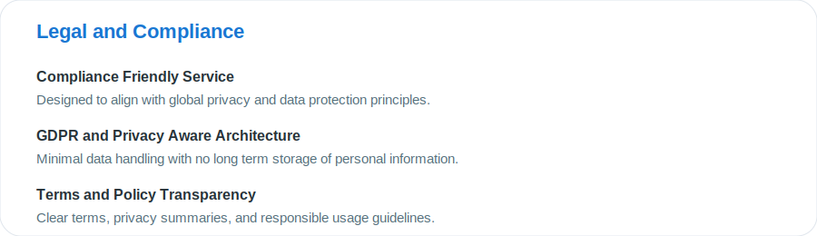
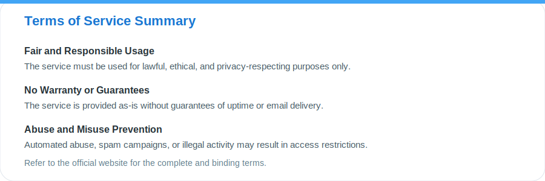
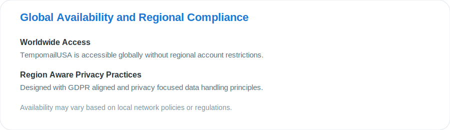
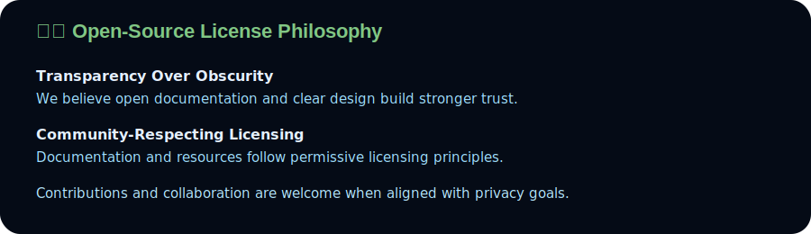
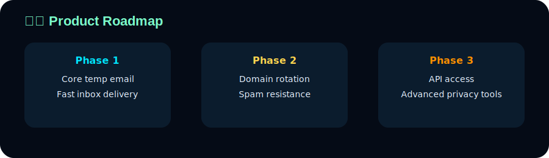

  

  <strong>Instant • Anonymous • Disposable Email</strong> 
  Privacy-first temporary email service built for the modern web

  🌐 <strong>https://tempomailusa.com</strong>

  

---

---

### 🧩 About the Project

TempomailUSA is a **privacy-focused disposable email service** designed to help users stay anonymous online without sacrificing convenience.

In today’s internet, email addresses are frequently harvested, sold, and abused.  
TempomailUSA solves this by providing **instant, temporary inboxes** that can be used for:

- Website registrations  
- App and service trials  
- Verification codes (OTP)  
- Testing email workflows  
- Preventing spam and tracking  

There is **no registration**, **no personal data collection**, and **no long-term storage**.

---

### ⚙️ Core Capabilities Explained

**Why TempomailUSA is different:**

- **Instant inbox generation** — no setup, no waiting  
- **No identity exposure** — your real inbox stays private  
- **No logs, no tracking** — minimal data footprint  
- **Reliable delivery** — built for verification emails  
- **Developer-friendly** — ideal for testing & QA  

---

### 🧠 Who Uses Disposable Email?

#### 👤 Everyday Users
- Avoid spam after signups  
- Protect personal email  
- Access gated content safely  

#### 👨‍💻 Developers & Testers
- Test email flows  
- QA signup systems  
- Validate delivery behavior  

#### 🛡️ Privacy-Conscious Users
- Reduce digital footprint  
- Avoid data brokers  
- Stay anonymous online  

---

---

---

---

---

### 📚 Privacy & Email Security Resources

- Disposable Email — Wikipedia  
  https://en.wikipedia.org/wiki/Disposable_email_address  

- Electronic Frontier Foundation — Online Privacy  
  https://www.eff.org/issues/online-privacy  

- Privacy Guides  
  https://www.privacyguides.org  

---

## 🔍 Philosophy & Principles

- Privacy by default  
- Minimal data exposure  
- Transparency over tracking  
- User-first design  
- No dark patterns  

> Give users control over their inbox and their identity.

---

## 🚀 Getting Started

1. Visit 👉 https://tempomailusa.com  
2. Get a temporary email instantly  
3. Use it anywhere  
4. Receive emails securely  

No signup. No tracking.

---

## 🌍 Official Website

➡️ **https://tempomailusa.com**

A clean, fast, and anonymous way to receive emails  
without exposing your real inbox.

**No spam.  
No tracking.  
No compromises.**
